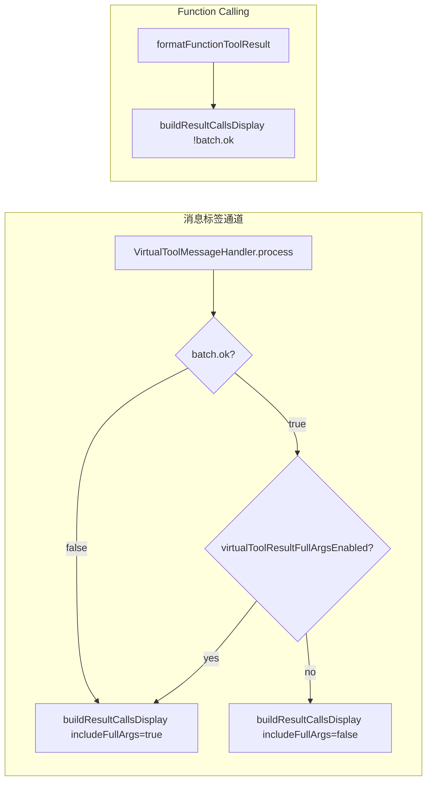

# VFS 虚拟工具结果完整入参展示 技术规格（SPEC）

## 设计目标

- 在**仅消息标签通道**（`<virtual-tool-result>`）为成功批次（`ok:true`）提供可开关的完整 `calls[].args` 展示。
- **默认关闭**，与 v1.0.9 前行为一致（成功仍为 `argsSummary`）。
- **失败路径不变**：`ok:false` 时始终完整 `args`，与 `VFS-Virtual-Tools-Evolutions` 已落地规则一致。
- **FC 隔离**：`formatFunctionToolResult` 仍使用 `buildResultCallsDisplay(calls, !batch.ok)`，不读取新开关。
- **不改动**工具执行、`read` 截断、`results[]` 结构。

## 总体方案

### 现状约束（基于代码）

| 模块 | 当前行为 |
|------|----------|
| `tool-result-payload.ts` | `buildResultCallsDisplay(calls, includeFullArgs)`：`true` → `{ tool, args }`；`false` → `{ tool, argsSummary }` |
| `virtual-tool-message-handler.ts` L153 | `buildResultCallsDisplay(envelope.calls, !batch.ok)` — 成功摘要、失败完整 |
| `format-function-tool-result.ts` L40 | 同上，FC 与消息共用 helper，第二参恒为 `!batch.ok` |
| `main.ts` L69–73 | `VirtualToolMessageHandler` 已注入 `getJsonRepairEnabled` 回调读 store |
| `vfs-extension-settings.schema.ts` | 已有 `virtualToolJsonRepairEnabled`（默认 `true`）；无 result 展示开关 |
| `App.vue` | JSON 修复 checkbox + `snapshotMaxCount`；无完整入参开关 |

核心改动：**不新增序列化分支**，仅在消息 handler 计算 `includeFullArgs` 时并入扩展设置：

```text
includeFullArgs = !batch.ok || extension.virtualToolResultFullArgsEnabled
```

FC 调用点保持 `includeFullArgs = !batch.ok`。



## 最终项目结构

```text
.apm/kb/docs/Iterations/VFS-Virtual-Tool-Full-Args/
  prd.md
  spec.md

src/
  infra/persistence/
    vfs-extension-settings.schema.ts     # 新增 boolean 字段 + parse/serialize/default
  app/services/message/
    virtual-tool-message-handler.ts      # 注入 getter；调整 includeFullArgs 计算
  App.vue                                # 设置页 checkbox + 持久化
  main.ts                                # 向 handler 传入 getter（与 JSON 修复并列）

tests/
  persistence.schema.test.ts             # 默认值与序列化
  tool-result-payload.spec.ts            # （可选）补充组合语义注释用例
  virtual-tool-message-result.spec.ts    # 成功 + 开关开 → 完整 args
  virtual-tool-full-args.spec.ts         # 新增：成功默认关、开关开/关矩阵

.apm/kb/docs/Tools.md                    # 可选：calls 字段说明补一句设置项（实现时同步）
```

**不改动**：`format-function-tool-result.ts`、`vfs-function-tool-registry.ts`、`tool-result-payload.ts` 函数签名（仅更新模块注释）。

## 变更点清单

### 1) 扩展设置 schema

**文件**：`src/infra/persistence/vfs-extension-settings.schema.ts`

| 项 | 值 |
|----|-----|
| 字段名 | `virtualToolResultFullArgsEnabled` |
| 类型 | `boolean` |
| 默认 | `false` |
| parse | 非 boolean → `DEFAULT_SETTINGS.virtualToolResultFullArgsEnabled` |
| serialize | `Boolean(state.virtualToolResultFullArgsEnabled)` |

与 `virtualToolJsonRepairEnabled` 并列，写入同一 `extensionSettings['st-virtual-file-system']` 扁平对象。

### 2) 消息 handler

**文件**：`src/app/services/message/virtual-tool-message-handler.ts`

- 构造函数增加可选第三参（与 JSON 修复对称）：

```ts
private readonly getResultFullArgsEnabled: () => boolean = () => false
```

- 构建 payload 处（约 L151–157）：

```ts
const includeFullArgs = !batch.ok || this.getResultFullArgsEnabled()
calls: buildResultCallsDisplay(envelope.calls, includeFullArgs),
```

- 模块头注释补充：成功时完整 `args` 由扩展设置控制；失败恒为完整 `args`。

### 3) 运行时接线

**文件**：`src/main.ts`

```ts
const messageHandler = new VirtualToolMessageHandler(
  runtime,
  logs,
  () => vfsPersistenceStore.getState().extension.virtualToolJsonRepairEnabled,
  () => vfsPersistenceStore.getState().extension.virtualToolResultFullArgsEnabled,
)
```

（若将两个 getter 合并为 `options` 对象亦可，但本迭代优先最小 diff：追加第四实参。）

### 4) 设置页 UI

**文件**：`src/App.vue`

- `ref`：`virtualToolResultFullArgsEnabled`，默认 `false`
- `onMounted` / `subscribe` 与 store 同步
- `handleResultFullArgsToggle` → `vfsPersistenceStore.updateExtension`
- 位置：紧挨 JSON 修复 checkbox 下方
- 文案建议：
  - 标签：`成功时在消息结果中展示完整工具入参（仅消息标签通道）`
  - 提示：`默认关闭；开启后 <virtual-tool-result> 的 calls 含完整 args，可能增大消息体积`
- 样式：复用 `.vfs-json-repair` / `.vfs-hint` 类名（可复用 `vfs-json-repair` 或新增 `vfs-full-args` 间距类）

### 5) 共享 helper 注释

**文件**：`src/app/services/virtual-tools/tool-result-payload.ts`

更新 `buildResultCallsDisplay` 文档注释：

- 第二参为「是否在 `calls` 中写入完整 `args`」；
- 消息通道成功路径由 `virtualToolResultFullArgsEnabled` 决定；
- FC 仅在 `!batch.ok` 时为 `true`。

**不修改** `format-function-tool-result.ts` 调用方式。

### 6) 使用者文档（实现阶段）

**文件**：`.apm/kb/docs/Tools.md` — `calls` 表格「成功」行补充：

- 默认 `{ tool, argsSummary }`；
- 扩展设置开启「成功时展示完整入参」后为 `{ tool, args }`。

## 详细实现步骤

### Step 1 — Schema 与默认值

1. 在 `VfsExtensionSettings` 增加 `virtualToolResultFullArgsEnabled: boolean`。
2. `DEFAULT_SETTINGS` 设为 `false`。
3. `parseVfsExtensionSettings` / `serializeVfsExtensionSettings` 补齐读写。
4. 跑 `tests/persistence.schema.test.ts` 断言扩展。

### Step 2 — Handler + main 接线

1. `VirtualToolMessageHandler` 增加 getter 与 `includeFullArgs` 逻辑。
2. `main.ts` 传入 store 读取函数。
3. 确认异常兜底 `replaceCallWithResult`（L217 `calls: []`）无需改动。

### Step 3 — 设置页

1. `App.vue` 增加 checkbox 与持久化 handler。
2. 手动验证：切换后刷新设置页状态保持（AC-5）。

### Step 4 — 测试

1. 新增 `tests/virtual-tool-full-args.spec.ts`（或扩展现有 `virtual-tool-message-result.spec.ts`）。
2. 更新 `persistence.schema.test.ts` 期望对象含新字段。
3. 全量 `npm run test:run`。

### Step 5 — 文档与索引（可选同 PR）

1. 更新 `Tools.md` 中 `calls` 说明。
2. `apm kb index rebuild`（若批量改 kb）。

## 测试策略

### 单元 / 集成（Vitest）

| ID | 场景 | 断言 |
|----|------|------|
| T-FA-1 | `buildResultCallsDisplay(calls, false)` | `argsSummary` 存在，`args` 无 |
| T-FA-2 | `buildResultCallsDisplay(calls, true)` | `args` 深等于入参 |
| T-FA-3 | handler 成功 + getter `false`（默认） | result JSON `calls[0].argsSummary` 有，`args` 无 |
| T-FA-4 | handler 成功 + getter `true` | `calls[0].args` 与 call 块一致 |
| T-FA-5 | handler 失败 + getter `true`/`false` | 均有完整 `args` |
| T-FA-6 | `formatFunctionToolResult` 成功 + 扩展开关开（store mock 无关） | 仍为 `argsSummary`（FC 不读开关） |
| T-FA-7 | `parseVfsExtensionSettings({})` | `virtualToolResultFullArgsEnabled === false` |
| T-FA-8 | serialize 往返 | boolean 保持 |

**实现提示**：`virtual-tool-message-result.spec.ts` 已有失败路径用例；新增成功路径时复用 `createAdapterMock` + `VirtualToolMessageHandler(runtime, logs, () => true, () => fullArgsFlag)`。

### 手工冒烟

1. 设置关 → 发 `write` 成功 call → 消息内 result 仅见 `argsSummary`。
2. 设置开 → 同上 → 见完整 `path`/`content`。
3. 故意 `replace` 失败 → 无论开关，见完整 `args`。
4. FC `vfs_write` 成功 → ST 工具记录仍为摘要形态（与 T-FA-6 一致）。

## 风险与回滚方案

| 风险 | 缓解 |
|------|------|
| 大 `write`/`read` 成功批次导致 result JSON 膨胀、token 增加 | 默认关；设置页提示体积风险；不取消 `read` 的 `results.data` 截断 |
| 用户误以为 FC 也会展示完整 args | UI 文案标明「仅消息标签通道」；T-FA-6 锁定 FC |
| 历史消息 result 不会回溯改写 | PRD 已排除迁移；仅影响新执行批次 |
| getter 在 handler 构造时闭包陈旧 | 与 `getJsonRepairEnabled` 相同：每次 `process` 调用 getter 读最新 store |

**回滚**：删除字段并将 handler 恢复为 `!batch.ok` 单条件；旧持久化中的多余 boolean 键由 parse 忽略即可，无数据迁移脚本。

---

**文档路径**：`.apm/kb/docs/Iterations/VFS-Virtual-Tool-Full-Args/spec.md`  
**对齐 PRD**：`.apm/kb/docs/Iterations/VFS-Virtual-Tool-Full-Args/prd.md`（AC-1～AC-6）

**请确认本 SPEC 后再进入编码。**
