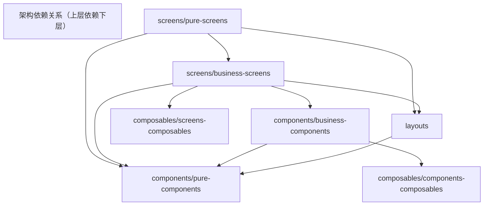

# 前端结构

当前 `src/app` 的实际目录分为：

- `screens/pure-screens`：纯 UI 组装层，不承载业务逻辑。
- `screens/business-screens`：页面业务层，负责状态与业务编排。
- `components/business-components`：业务组件层，封装业务行为与交互。
- `components/pure-components`：通用无业务组件层。
- `layouts`：布局组件层。
- `composables/screens-composables`：服务于 `business-screens` 的组合式逻辑，包含业务数据注入与服务调用。
- `composables/components-composables`：服务于 `business-components` 的组合式逻辑，封装组件级状态与交互逻辑。

## 目录快照（与当前结构一致）

```text
app/
  components/
    business-components/
    pure-components/
  composables/
    components-composables/
    screens-composables/
  layouts/
  screens/
    business-screens/
    pure-screens/
```

## 图依赖



